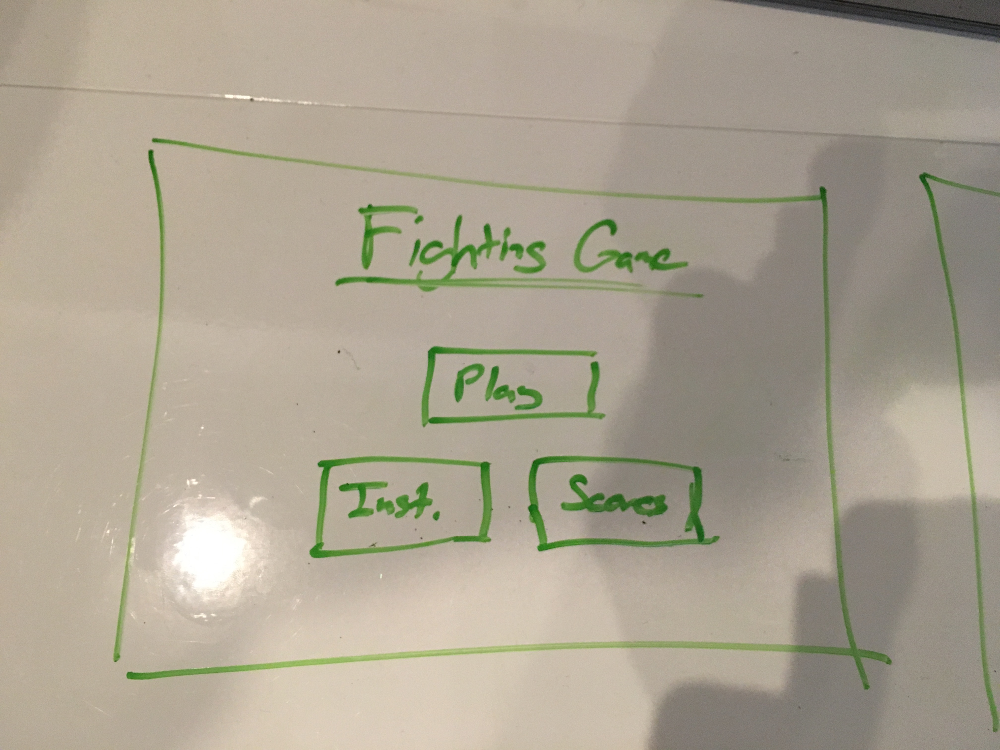

# Project 1: Powerpuff Girls - The Game

---
## The City of Townsville is under attack!
An endless horde of monsters has descended on the city, and it's up to The Powerpuff Girls to stop them! How long can you survive?

Control you character with the **left** and **right arrow keys**

---

### Technologies Used

For this project, I used the [Panda.js](http://www.pandajs.net/) game engine (essentially a gigantic library) as the baseline for my work. This is a javascript-based 2d gaming engine that is designed to be quick to learn, and quicker to build in.
Thanks to Panda.js, I was able to spend more of my time crafting a project I could be proud of by the end of the course, and less time wrestling with the little things. Everything from adding sprites to programming collision detection was streamlined. I will admit, however, that I spend the better part of the first two days figuring out how the engine worked, both by trial and error, and by ripping apart [these](https://github.com/ekelokorpi/panda.js-engine-games) example games.
Using Panda.js also means that I am making minimal use of hard-coded CSS (everything is rendered in HTML canvas), and am not using any JQuery. This was all approved beforehand.

---

### Process/Design Diary

My goal from the beginning was to make a game that I would want to play.
I approached the game by building from the ground up, aiming to hit a few functionality milestones each day. Though I hit most of my goals when I aimed to, there were still quite a few bumps along the way.
I started with the background (was more post-apocalyptic to start with), and got that to respond to arrow key input. Next was adding a sprite, placing my player character, and giving them an idle animation.
Next in line was adding enemy sprites, and figuring out how basic physics and collision detection worked in Panda.js. Over the course of the day, my character went from not responding to my input at all (I had to bind the sprite to a physics object), to falling through the floor (didn't realize gravity was a parameter), to finally reacting to an enemy when they collided.
With the basic functionality down, I now had the time to the specifics of how I wanted the game to play: collision force/velocity, background movement speed, player lives, etc.
Once that was done, I could start getting into the fun part, and adding the bells and whistles that would turn this into a "real" game. I swapped out the background and player sprites, added more animations, added a score counter, and found background music.

*Side note: The Powerpuff Girls theme was completely unintentional. I was going for a post-apocalyptic fighting game, then stumbled on some fantastic Powerpuff Girl sprites, and opted for a trip down memory lane instead.*

At this point my MVP was done, and I could add on my finishing touches: play and reset buttons, character randomization, audio for attacks, as well as a couple fun enemy sounds.

---

### What's Left

Honestly, I'm probably going to continue working on this project, as there are still a few things I'd like to add:

    * A leaderboard
    * Reworked, more consistent physics
    * Randomized hit vectors (sending enemies flying into the air)
    * Additional enemies who can take more than one hit

---

### Unsolved Issues

A couple things that could use some work:

    * Adding mass/gravity/vectors/force to my physics (hitting an enemy just sets a velocity right now)
    * Fixing the scoring system. As it stands, the score is accurate about 90% of the time, as it counts each hit 2~4 times instead of once.
    * Figuring out a more consistent system for determining attack states. I originally wanted to include a counter of misses (player attacks but doesn't hit an enemy), and then use a ratio of that to hits to give the player a score, but couldn't figure out how to code a "missed" state.

---

## Wireframes

